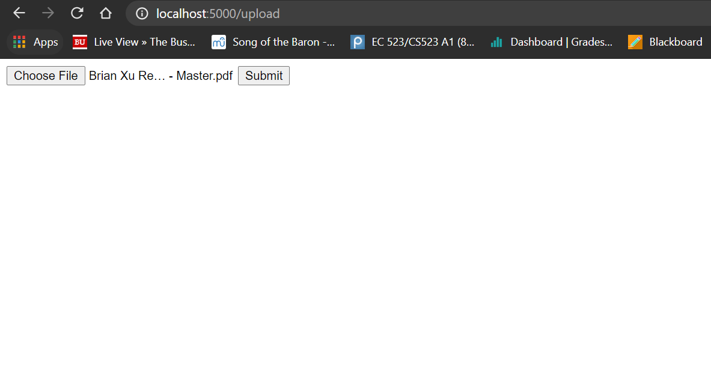
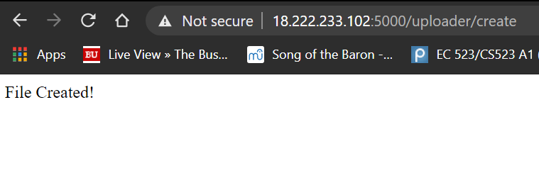

# News Analyzer Application Suite
News Analyzer API suite using Flask, Google NLP, MongoDB.

SEE RESULTS SECTION FOR GRADING

## Module Outlines

### I. File Uploader
#### Design
As a user of this API, I would want to be able to:
1. Upload a file successfully into some file storage on the cloud.
2. Have this file be documented in a database for easy access later on.
3. See some confirmation on whether my file was successfully uploaded or not.

This module will be both procedure and entity based. The actual file uploading task will be designed to be procedural based due to the different types of user input. The flexibility offered by a task-by-task API will allow different upload types (jpg, pdf, docx) to have their own individual process flows.

In my final build, I elected to use mongoDB + pymongo in order to document each inserted document and I use a local filestore in order to store all the necessary files. 

#### Methods
Sample High Level Methods

- createFile(inFile) : Function that completes all necessary tasks upon receiving a new document
  - documentFile : Creates an entry in the database tracking all stored documents. Includes timestamp, size, tags, etc.
  - storeFile(inFile) : Takes in file and stores it in a filestore service (Google Cloud, Azure, etc.)

- deleteFile(fileID) : Deletes a file from the database and the filestore

- readFile(fileID) : Query database for specific record in database.

- updateFile(fileID, inFile) : Replace specific record in database and filestore.
  
  
### II. Text NLP Analysis
#### Design
As a user of this API, I would want to be able to:
1. Pass blocks of text to the API and receive some type of analysis/score output.
2. Pass documents from the filestore into the API with just a filestore ID
3. Find most common words in each article

This module will be mostly entity based in design. The focus of this module is getting analysis of files in the filestore and database. This involves querying the database with some specific file ID and obtaining analysis of the database/filestore as output. For the sake of an example, we will assume we are using some sentiment analysis API.

#### Methods
Sample High Level Methods

- analyzeText(string text) : returns a sentiment score of the input text.

- findMCW(fileID) : Finds the Most Common Words in the article, returns a list of 5-10 most common words that are not helper words.

### III. Newfeed Ingestor
#### Design
As a user of this API, I would want to be able to:
1. Load a list of relevant articles based on some keyword or query term
2. Load a list of relevant articles based on views

This module will be procedure based. This is because the only function needed to achieve the functionality required is just a procedural query of the database used in the File Upload module. 

#### Methods
Sample High Level Methods

- createFeed(query) : Search the database for articles with the query term in it. Returns a JSON Object

- createFeed('popular') : Return a JSON object containing a list of most popular viewed articles.

## Results
In order to run this code, make sure you have the environment variable "GOOGLE_APPLICATION_CREDENTIALS" set to be the path of your API Key.

Here is a link to the deployed application (limited availability): 

### Uploader
The application starts off with the user on a home page with a simple file upload selection and confirmation button.  

Once a file is uploaded, the upload will be documented in a mongoDB Cloud database and the user will be taken to a page with analysis from the ingestor module will be displayed.
### Ingestor
Upon upload, the application will automatically run its ingestor functions so that entries in the filestore and database will have content in their respective cells. 

Some functionality included are a pdf2text conversion so we can get text data, an NLP functionality to analyze that text and provide sentiment, and finally a bunch of metadata from the PDF file itself. 

Note: PDF files vary in the amounts of metadata in them. Since PDFs are not regulated in any way or standard, some functionalities can be quite pointless or lacking in success. 
### NLP - Sentiment Analysis
The NLP analysis included is a basic usage of the sentiment analysis API from the Google NLP Library. Specifically, text data is fed to the API and a response of a score and magnitude is provided based on postive or negative general sentiment. 

Unfortunately, the functionality of this portion of the application is very limited due to the fact that PDF files are not always full of text data and the PDF2Text package used in the ingestor is not as robust as one would like.

### Deployed on AWS EC2
The app was deployed on AWS and can be graded on 4/6/21 from 9AM to 6PM. Here is a picture of a stub when the app prototype was first deployed as evidence of completion:

